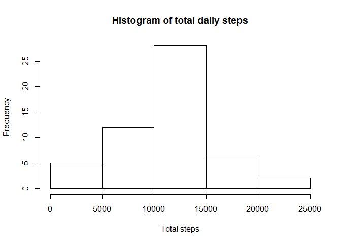
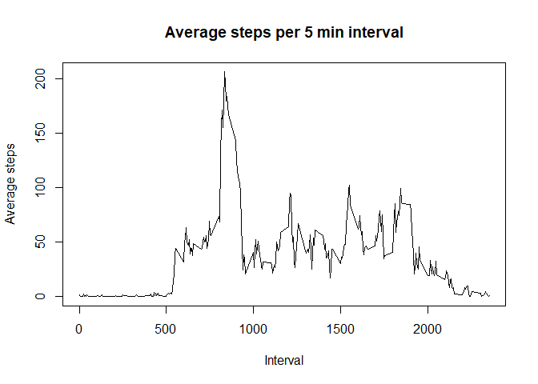
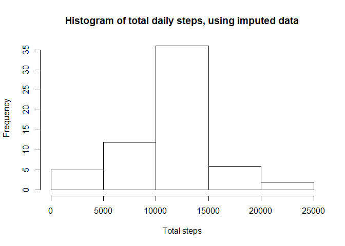

## Loading and preprocessing the data
Set the working directory, load the data and return a summary of the file to check it has loaded properly.


```r
setwd("~/R/Coursera/RepAnalysis/RepData_PeerAssessment1")
act <- unzip("activity.zip")
data <- read.csv(act)
summary(data)
```

```
##      steps                date          interval     
##  Min.   :  0.00   2012-10-01:  288   Min.   :   0.0  
##  1st Qu.:  0.00   2012-10-02:  288   1st Qu.: 588.8  
##  Median :  0.00   2012-10-03:  288   Median :1177.5  
##  Mean   : 37.38   2012-10-04:  288   Mean   :1177.5  
##  3rd Qu.: 12.00   2012-10-05:  288   3rd Qu.:1766.2  
##  Max.   :806.00   2012-10-06:  288   Max.   :2355.0  
##  NA's   :2304     (Other)   :15840
```


## What is mean total number of steps taken per day?
Calculate total daily steps using tapply on data, summing the steps for each unique date.  Generate a histogram using hist().  Generate mean and median using summary().


```r
steps <- with(data, tapply(steps,
                           date,
                           sum))

hist(steps,
     main = "Histogram of total daily steps",
     xlab = "Total steps")
```

<!-- -->

```r
summarysteps <- summary(steps)
summarysteps
```

```
##    Min. 1st Qu.  Median    Mean 3rd Qu.    Max.    NA's 
##      41    8841   10765   10766   13294   21194       8
```

####The **median** number of daily steps was **10765**

####The **mean** number of daily steps was **10766**


## What is the average daily activity pattern?
Use tapply() to calculate the average number of steps taken averaged across all days.  Process the output into a dataframe with an interval column.  Use plot() to generate the time series line plot.  Filter the 5 minute interval with the maximum number of steps using which().


```r
pattern <- with(data, tapply(steps,
                             interval,
                             mean,
                             na.rm = T))

df <- as.data.frame(pattern)
df$interval <- rownames(df)

plot(df$interval,
     df$pattern,
     type = "l",
     main = "Average steps per 5 min interval",
     xlab = "Interval",
     ylab = "Average steps")
```

<!-- -->

```r
maxinterval <- df[which(df$pattern == max(df$pattern)), ]
maxinterval
```

```
##      pattern interval
## 835 206.1698      835
```

####The 5 minute interval containing the maximum number of steps was **835**, with an average of **206.17** steps.


## Imputing missing values
###Calculate and report number of NAs in the dataset


```r
NAs <- sum(is.na(data))
nobs <- nrow(data)

percent <- round((NAs/nobs)*100, 1)
```

####The activity dataset is **17568** rows long, and has **2304** NAs, which equates to **13.1%**


###Replace NAs with values

To impute missing values, I have chosen to replace the NA values with the mean number of steps recorded across all of the days, for that particular 5 minute interval.

The dataframe 'data' has the original values.  The dataframe 'df' contains the average number of steps per 5 minute interval.  Use dplyr to transmute an imputed column.


```r
library(dplyr)
```

```
## 
## Attaching package: 'dplyr'
```

```
## The following objects are masked from 'package:stats':
## 
##     filter, lag
```

```
## The following objects are masked from 'package:base':
## 
##     intersect, setdiff, setequal, union
```

```r
imp <- merge(data, df, by = "interval")
imp <- with(imp,
            imp[order(date, interval), ])

newdata <- imp %>% transmute(date,
                             interval,
                             imputed = ifelse(is.na(steps),
                                              pattern,
                                              steps))
                         
head(data, 3)
```

```
##   steps       date interval
## 1    NA 2012-10-01        0
## 2    NA 2012-10-01        5
## 3    NA 2012-10-01       10
```

```r
head(newdata, 3)
```

```
##         date interval   imputed
## 1 2012-10-01        0 1.7169811
## 2 2012-10-01        5 0.3396226
## 3 2012-10-01       10 0.1320755
```


###Make histogram of new data


```r
impsteps <- with(newdata, tapply(imputed,
                                 date,
                                 sum))
                          
hist(impsteps,
     main = "Histogram of total daily steps, using imputed data",
     xlab = "Total steps")
```

<!-- -->

```r
summaryimpsteps <- summary(impsteps)
summaryimpsteps
```

```
##    Min. 1st Qu.  Median    Mean 3rd Qu.    Max. 
##      41    9819   10766   10766   12811   21194
```

####Using the imputed data, the **median** number of daily steps was **10766**

####The **mean** number of daily steps was **10766**

####The method of replacing missing data with the average number of steps taken across all the days for that 5 minute interval has not altered the estimates of mean or median number of steps taken for the dataset.


## Are there differences in activity patterns between weekdays and weekends?
To create a lattice plot with average number of steps taken at a weekend or weekday, first the days must be identified as weekend or weekday.

Next, averages must be calculated, for each factor (weekend or weekday).

Finally, those averages must be plotted using the lattice package

###Identify a date as weekend or weekday

The information in the date column was converted to POSIXct, and then the day of the week identified with weekday()


```r
newdata$date <- as.POSIXct(newdata$date)
newdata$day <- weekdays(newdata$date)
newdata <- newdata %>%  transmute(interval, date, imputed, day, flag = ifelse(day == "Saturday", "Weekend", ifelse(day == "Sunday", "Weekend", "Weekday")))

head(newdata, 3)
```

```
##   interval       date   imputed    day    flag
## 1        0 2012-10-01 1.7169811 Monday Weekday
## 2        5 2012-10-01 0.3396226 Monday Weekday
## 3       10 2012-10-01 0.1320755 Monday Weekday
```


###Calculate average steps taken for weekend and weekdays

Averages for each interval for weekend and weekdays were calculated using tapply, and transposed as a first step to a tidy dataset.


```r
newpattern <- with(newdata, tapply(imputed, list(flag, interval), mean))
newpattern <- as.data.frame(t(newpattern))

head(newpattern, 3)
```

```
##      Weekday    Weekend
## 0  2.2511530 0.21462264
## 5  0.4452830 0.04245283
## 10 0.1731656 0.01650943
```


###Tidy data
The resulting matrix was processed into a tidy dataset with tidyr package.


```r
library(tidyr)

newpattern$interval <- as.integer(rownames(newpattern))

tidydf <- gather(newpattern,
                 flag,
                 steps, 
                 -interval)

head(tidydf, 3)
```

```
##   interval    flag     steps
## 1        0 Weekday 2.2511530
## 2        5 Weekday 0.4452830
## 3       10 Weekday 0.1731656
```

```r
str(tidydf)
```

```
## 'data.frame':	576 obs. of  3 variables:
##  $ interval: int  0 5 10 15 20 25 30 35 40 45 ...
##  $ flag    : chr  "Weekday" "Weekday" "Weekday" "Weekday" ...
##  $ steps   : num  2.251 0.445 0.173 0.198 0.099 ...
```


###Create lattice plot

The two panel plot can be created using the lattice package.


```r
library(lattice)

mylattice <- xyplot(steps ~ interval | flag, 
                    data = tidydf, 
                    layout = c(1, 2),
                    type = "l",
                    xlab = "Interval", 
                    ylab = "Number of steps")

mylattice
```

<!-- -->


####Weekday steps are higher on average between around 8 and 9 am.  The peak is not observed to the same extent at weekends.
